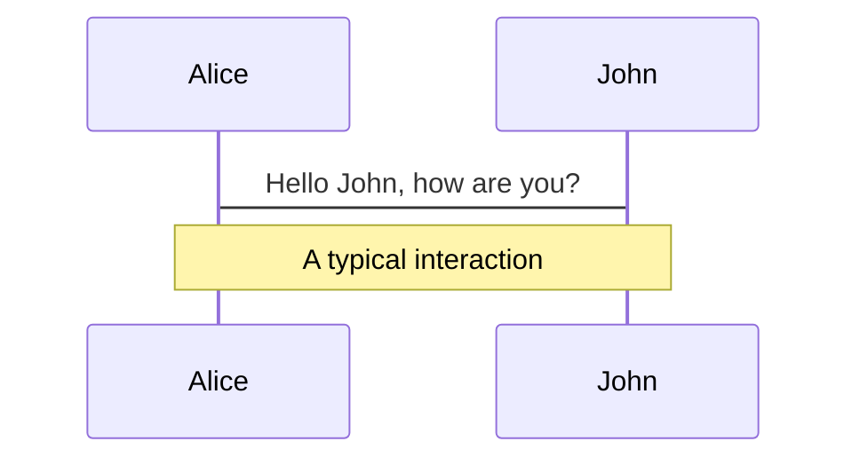
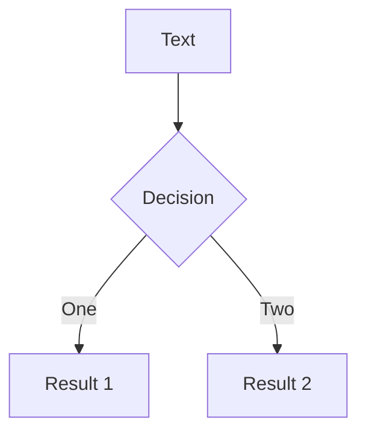
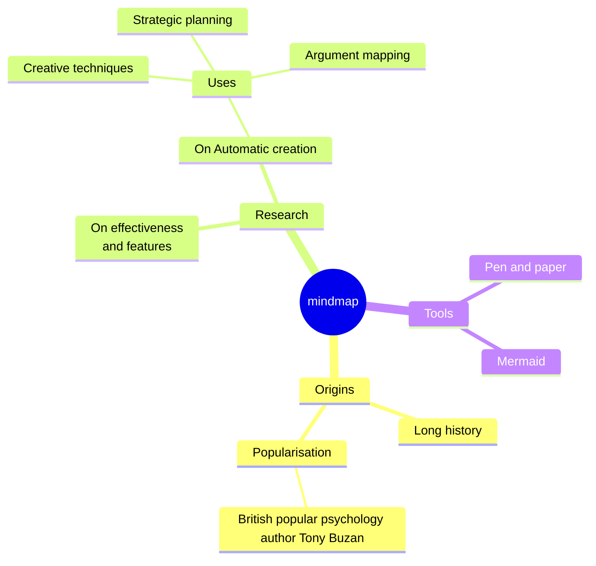
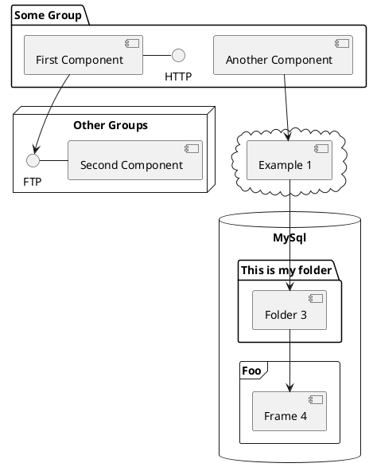

---
# You can also start simply with 'default'
theme: ./theme
# random image from a curated Unsplash collection by Anthony
# like them? see https://unsplash.com/collections/94734566/slidev
background: https://cover.sli.dev
# some information about your slides (markdown enabled)
title: Palestra IA
titleTemplate: '%s - Merieli'
author: Meriéli Manzano
info: |
  ## IA sem Frustração

  Uma apresentação sobre IA produtiva no trabalho de desenvolvedor.
# apply unocss classes to the current slide
class: text-center
# https://sli.dev/features/drawing
# fonts:
#   sans: Roboto
#   serif: Roboto Slab
#   mono: Fira Code
drawings:
  persist: false
# slide transition: https://sli.dev/guide/animations.html#slide-transitions
transition: slide-left
# enable MDC Syntax: https://sli.dev/features/mdc
mdc: true
# open graph
# seoMeta:
#  ogImage: https://cover.sli.dev

presenter: false
---

# De pedreiro a Arquiteto

Repensando a Programação na Era da IA.

<div class="abs-br m-6 text-xl">
  <button @click="$slidev.nav.openInEditor()" title="Open in Editor" class="slidev-icon-btn">
    <carbon:edit />
  </button>
  <a href="https://github.com/Merieli" target="_blank" class="slidev-icon-btn">
    <carbon:logo-github />
  </a>
</div>

<!--
The last comment block of each slide will be treated as slide notes. It will be visible and editable in Presenter Mode along with the slide. [Read more in the docs](https://sli.dev/guide/syntax.html#notes)
-->

---
class: px-20
---

# Momento Copiloto

A revolução da IA no desenvolvimento não é sobre *substituir* o programador. É sobre *promovê-lo*.

<div grid="~ cols-2 gap-2" m="t-2">

Digitar código

Dirigir a criação de código

</div>

**Agenda da Palestra:**
* O que é a IA Generativa (no contexto do dev).
* A Mudança de Paradigma: O "Novo Pensamento".
* Como Usar (O Ciclo de Vida do Dev).
* Desafios e o Futuro.


---
class: px-20
---

## A Mudança de Paradigma

| **Antigo Programador (O Pedreiro)**                            | **Novo Programador (O Arquiteto/Diretor)**                             |
| :--------------------------------------------------------- | :------------------------------------------------------------------ |
| Digitar código linha a linha.                              | Escrever prompts e *revisar* código gerado.                         |
| Escrevo o código pra resolver o problema, depois refatorar e refinar. | Planejo como irei implementar a minha ideia, com a ajuda da IA defino a melhor arquitetura e deisgn pattern para a solução e depois peço para o modelo aplicar o plano. |
| "Como *eu* escrevo esta lógica?"                           | "Como *eu explico* esta lógica para a IA?"                          |
| "Onde está o *meu* erro?"                                  | "O que a IA *não entendeu* do meu pedido?"                          |
| Eficiência na digitação, conhecimento profundo da sintaxe. | Clareza de comunicação, visão de sistema, velocidade de integração. |


---
layout: image-left
image: /images/robo-paradoxo.jpeg
backgroundSize: cover
---

# O Paradoxo

<List :items="[
    {
      label: 'Promessa',
      text: 'produtividade, automação, menos retrabalho.'
    },
    {
      label: 'Realidade',
      text: 'frustração, dependência, erros sutis.'
    }
  ]" 
/>

---
transition: fade-out
class: gradient-blue
---

# Falhas da IA: o lado que ninguém pode ignorar

- 🤹 **Alucinações** - respostas inventadas, mas com “tom de verdade”.
- 💀 **Dependência perigosa:** aceitar código/soluções sem validação.
- 📝 **Falta de contexto:** respostas boas em teoria, ruins na prática.
- 🛠 **Produtividade ilusória:** gastar mais tempo revisando do que criando.
  
* Exemplo prático: mostrar um bug que a IA “explica” de forma convincente, mas totalmente errada.
  👉 Mensagem: *“Não podemos confiar 100%. O segredo está em como guiamos e validamos a IA.”*
<br>
<br>
---
transition: fade-out
---

# Armadilha dos LLMs

As vezes a IA não traz verdades absolutas, e simula que tem uma resposta ao obter um conteúdo que ele já conhece, mas que não necessariamente é do link que você pediu.

<List :items="[
    {
      label: 'Citação inadequada de fontes',
      text: 'parecem ser confiáveis mas são inventadas'
    },
    {
      label: 'Viés',
      text: 'conteúdo estereotipado ou preconceituoso'
    },
    {
      label: 'Alucinações',
      text: 'respostas que parecem confiáveis, mas são incorretas'
    },
    {
      label: 'Prompt Hacking',
      text: 'podem ser manipulados para gerar conteúdo específico.'
    }
  ]" 
/>

- Erros de matemática: têm dificuldades com tarefas matemáticas e podem fornecer respostas incorretas.
- Mesmo repetindo o que ele precisa fazer, corre o risco dele são seguir o que foi pedido

> NUNCA CONFIE 100%, SEMPRE VALIDE SE ESTÁ CERTO!

> 
> Sempre seja crítico, a IA pode alucinar, a tendência dela é responder o que você quer, mesmo que o que você queira esteja errado. Então sempre valide o que ela te entregar.

<br>
---
layout: two-cols
layoutClass: gap-16
---

# Table of contents

You can use the `Toc` component to generate a table of contents for your slides:

```html
<Toc minDepth="1" maxDepth="1" />
```

The title will be inferred from your slide content, or you can override it with `title` and `level` in your frontmatter.

::right::

<Toc text-sm minDepth="1" maxDepth="2" />

---
layout: image-right
image: https://cover.sli.dev
---

# Code

Use code snippets and get the highlighting directly, and even types hover!

```ts [filename-example.ts] {all|4|6|6-7|9|all} twoslash
// TwoSlash enables TypeScript hover information
// and errors in markdown code blocks
// More at https://shiki.style/packages/twoslash
import { computed, ref } from 'vue'

const count = ref(0)
const doubled = computed(() => count.value * 2)

doubled.value = 2
```

<arrow v-click="[4, 5]" x1="350" y1="310" x2="195" y2="342" color="#953" width="2" arrowSize="1" />

<!-- This allow you to embed external code blocks -->
<<< @/snippets/external.ts#snippet

<!-- Footer -->

[Learn more](https://sli.dev/features/line-highlighting)

<!-- Inline style -->
<style>
.footnotes-sep {
  @apply mt-5 opacity-10;
}
.footnotes {
  @apply text-sm opacity-75;
}
.footnote-backref {
  display: none;
}
</style>

<!--
Notes can also sync with clicks

[click] This will be highlighted after the first click

[click] Highlighted with `count = ref(0)`

[click:3] Last click (skip two clicks)
-->

---
level: 2
---

# Shiki Magic Move

Powered by [shiki-magic-move](https://shiki-magic-move.netlify.app/), Slidev supports animations across multiple code snippets.

Add multiple code blocks and wrap them with <code>````md magic-move</code> (four backticks) to enable the magic move. For example:

````md magic-move {lines: true}
```ts {*|2|*}
// step 1
const author = reactive({
  name: 'John Doe',
  books: [
    'Vue 2 - Advanced Guide',
    'Vue 3 - Basic Guide',
    'Vue 4 - The Mystery'
  ]
})
```

```ts {*|1-2|3-4|3-4,8}
// step 2
export default {
  data() {
    return {
      author: {
        name: 'John Doe',
        books: [
          'Vue 2 - Advanced Guide',
          'Vue 3 - Basic Guide',
          'Vue 4 - The Mystery'
        ]
      }
    }
  }
}
```

```ts
// step 3
export default {
  data: () => ({
    author: {
      name: 'John Doe',
      books: [
        'Vue 2 - Advanced Guide',
        'Vue 3 - Basic Guide',
        'Vue 4 - The Mystery'
      ]
    }
  })
}
```

Non-code blocks are ignored.

```vue
<!-- step 4 -->
<script setup>
const author = {
  name: 'John Doe',
  books: [
    'Vue 2 - Advanced Guide',
    'Vue 3 - Basic Guide',
    'Vue 4 - The Mystery'
  ]
}
</script>
```
````

---

# Components

<div grid="~ cols-2 gap-4">
<div>

You can use Vue components directly inside your slides.

We have provided a few built-in components like `<Tweet/>` and `<Youtube/>` that you can use directly. And adding your custom components is also super easy.

```html
<Counter :count="10" />
```

<!-- ./components/Counter.vue -->
<Counter :count="10" m="t-4" />

Check out [the guides](https://sli.dev/builtin/components.html) for more.

</div>
<div>

```html
<Tweet id="1390115482657726468" />
```

<Tweet id="1390115482657726468" scale="0.65" />

</div>
</div>

<!--
Presenter note with **bold**, *italic*, and ~~striked~~ text.

Also, HTML elements are valid:
<div class="flex w-full">
  <span style="flex-grow: 1;">Left content</span>
  <span>Right content</span>
</div>
-->

---

# Clicks Animations

You can add `v-click` to elements to add a click animation.

<div v-click>

This shows up when you click the slide:

```html
<div v-click>This shows up when you click the slide.</div>
```

</div>

<br>

<v-click>

The <span v-mark.red="3"><code>v-mark</code> directive</span>
also allows you to add
<span v-mark.circle.orange="4">inline marks</span>
, powered by [Rough Notation](https://roughnotation.com/):

```html
<span v-mark.underline.orange>inline markers</span>
```

</v-click>

<div mt-20 v-click>

[Learn more](https://sli.dev/guide/animations#click-animation)

</div>

---

# Motions

Motion animations are powered by [@vueuse/motion](https://motion.vueuse.org/), triggered by `v-motion` directive.

```html
<div
  v-motion
  :initial="{ x: -80 }"
  :enter="{ x: 0 }"
  :click-3="{ x: 80 }"
  :leave="{ x: 1000 }"
>
  Slidev
</div>
```

<div class="w-60 relative">
  <div class="relative w-40 h-40">
    
    
    
  </div>

  <div
    class="text-5xl absolute top-14 left-40 text-[#2B90B6] -z-1"
    v-motion
    :initial="{ x: -80, opacity: 0}"
    :enter="{ x: 0, opacity: 1, transition: { delay: 2000, duration: 1000 } }">
    Slidev
  </div>
</div>

<!-- vue script setup scripts can be directly used in markdown, and will only affects current page -->
<script setup lang="ts">
const final = {
  x: 0,
  y: 0,
  rotate: 0,
  scale: 1,
  transition: {
    type: 'spring',
    damping: 10,
    stiffness: 20,
    mass: 2
  }
}
</script>

<div
  v-motion
  :initial="{ x:35, y: 30, opacity: 0}"
  :enter="{ y: 0, opacity: 1, transition: { delay: 3500 } }">

[Learn more](https://sli.dev/guide/animations.html#motion)

</div>

---

# LaTeX

LaTeX is supported out-of-box. Powered by [KaTeX](https://katex.org/).

<div h-3 />

Inline $\sqrt{3x-1}+(1+x)^2$

Block
$$ {1|3|all}
\begin{aligned}
\nabla \cdot \vec{E} &= \frac{\rho}{\varepsilon_0} \\
\nabla \cdot \vec{B} &= 0 \\
\nabla \times \vec{E} &= -\frac{\partial\vec{B}}{\partial t} \\
\nabla \times \vec{B} &= \mu_0\vec{J} + \mu_0\varepsilon_0\frac{\partial\vec{E}}{\partial t}
\end{aligned}
$$

[Learn more](https://sli.dev/features/latex)

---

# Diagrams

You can create diagrams / graphs from textual descriptions, directly in your Markdown.

<div class="grid grid-cols-4 gap-5 pt-4 -mb-6">









</div>

Learn more: [Mermaid Diagrams](https://sli.dev/features/mermaid) and [PlantUML Diagrams](https://sli.dev/features/plantuml)

---
foo: bar
dragPos:
  square: 639,36,205,_,-16
---

# Draggable Elements

Double-click on the draggable elements to edit their positions.

<br>

###### Directive Usage

```md

```

<br>

###### Component Usage

```md
<v-drag text-3xl>
  <div class="i-carbon:arrow-up" />
  Use the `v-drag` component to have a draggable container!
</v-drag>
```

<v-drag pos="372,458,261,_">
  <div text-center text-3xl border border-main rounded>
    Double-click me!
  </div>
</v-drag>


###### Draggable Arrow

```md
<v-drag-arrow two-way />
```

<v-drag-arrow pos="67,452,253,46" two-way op70 />

---
src: ./pages/imported-slides.md
hide: false
---

---

# Monaco Editor

Slidev provides built-in Monaco Editor support.

Add `{monaco}` to the code block to turn it into an editor:

```ts {monaco}
import { ref } from 'vue'
import { emptyArray } from './external'

const arr = ref(emptyArray(10))
```

Use `{monaco-run}` to create an editor that can execute the code directly in the slide:

```ts {monaco-run}
import { version } from 'vue'
import { emptyArray, sayHello } from './external'

sayHello()
console.log(`vue ${version}`)
console.log(emptyArray<number>(10).reduce(fib => [...fib, fib.at(-1)! + fib.at(-2)!], [1, 1]))
```

---
layout: center
class: text-center
---

# Learn More

[Documentation](https://sli.dev) · [GitHub](https://github.com/slidevjs/slidev) · [Showcases](https://sli.dev/resources/showcases)

<PoweredBySlidev mt-10 />
